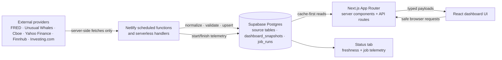
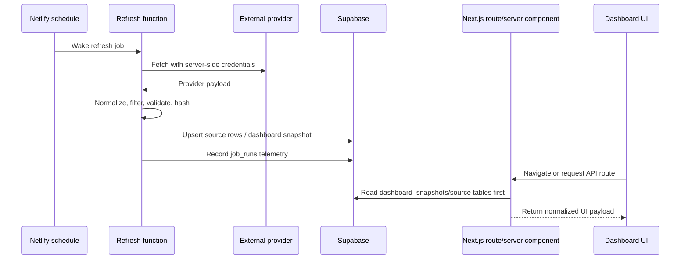

# AlphaDigest

AlphaDigest is a Next.js market intelligence dashboard built around server-side data ingestion, Supabase-backed cache tables, and Netlify scheduled functions. The product UI is intentionally compact; the engineering focus is reliable provider isolation, cache-first reads, typed API boundaries, and observable refresh jobs.

## Project overview

AlphaDigest combines market, news, calendar, economy, flow, ownership, and status data into a single dashboard without exposing privileged provider credentials to the browser. Netlify functions fetch and normalize external data server-side, Supabase stores durable source rows and dashboard snapshots, and the Next.js App Router renders React dashboard views from normalized cache/API payloads.

Detailed tab behavior lives in [`docs/`](docs/). This README focuses on system architecture and implementation decisions.

## Architecture at a glance



## Core engineering decisions

- **Next.js App Router + TypeScript** keeps page-level data loading, server components, API routes, and React UI boundaries typed and colocated.
- **Netlify Functions** isolate provider fetches and scheduled refreshes from browser traffic, including high-risk provider calls and service-role Supabase writes.
- **Supabase** acts as the durable cache, normalized source store, snapshot store, and job telemetry database.
- **Server-side-only provider keys** prevent privileged API credentials from reaching client bundles; browser code reads only safe app routes or rendered server payloads.
- **Cache-first UI reads** reduce latency, provider rate-limit pressure, and coupling between page navigation and third-party availability.
- **Zod validation** is used for dashboard API envelopes and payload schemas before responses are returned through shared helpers.
- **Scheduled refreshes** decouple ingestion from interactive browsing; users do not trigger most provider fetches directly.
- **Retention/pruning** is implemented for high-churn caches such as job telemetry, earnings windows, news/feed rows, flow rows, and source snapshots where relevant.

## Data flow



1. A scheduled Netlify function runs on a cron schedule, sometimes guarded by Toronto/Eastern market-session logic.
2. Provider APIs are fetched server-side.
3. Raw provider shapes are normalized into app-specific rows and payloads.
4. Supabase source tables and/or `dashboard_snapshots` are upserted.
5. Job telemetry is written to `job_runs`.
6. Next.js pages and API routes read cached rows/snapshots first, with fixture or live fallback paths only where implemented.
7. The Status tab reads job metadata and telemetry to surface stale, failed, skipped, or unknown refreshes.

## Provider and data source overview

Only providers present in the codebase are listed here:

| Provider/source | Current role |
| --- | --- |
| FRED | Economy time-series ingestion through `FRED_API_KEY`, stored in `fred_economy`, and cached under `economy:latest`. |
| Unusual Whales | Featured articles, news feed, earnings calendar, dark pool, whale feed, insider trades, institutional data, and congressional data where adapters/functions are wired. |
| Cboe | Server-side put/call market-statistics parser with optional Supabase persistence in `put_call_observations`. |
| Yahoo Finance public endpoints | Selected quotes, VIX-related metrics, market quote cache helpers, and SPY comparison data. |
| Finnhub | Market/heatmap quote flows and company/logo support when configured. |
| Investing.com economic calendar endpoint | Economic calendar events normalized into app event shapes and optional Supabase cache rows. |
| Supabase | Postgres persistence, dashboard snapshot cache, source metadata, and refresh telemetry. |
| Static fixtures/fallback files | Used only for specific fallback or not-yet-live areas; responses label fallback/mock modes where applicable. |

## Database schema overview

Supabase is organized around source-specific normalized tables plus small app-level cache/telemetry tables.

### Economy/FRED

Purpose: durable FRED observations for Economy charts and incremental refreshes.

```sql
fred_economy (
  id uuid primary key,
  provider text,
  series_id text,
  metric_key text,
  card_key text,
  date date,
  value numeric,
  unit text,
  frequency text,
  seasonal_adjustment text,
  source_label text,
  created_at timestamptz,
  updated_at timestamptz
)
```

Important constraints/indexes: unique `(provider, series_id, date)` and lookup indexes by metric/card plus descending date. Refreshes fetch only missing/new observations after the latest saved series date when possible.

### Dashboard snapshots and metadata

Purpose: frontend-ready cache payloads such as `today:latest`, `markets:latest`, `news-calendar:latest`, `flow:latest`, `ownership:latest`, and `economy:latest`.

```sql
dashboard_snapshots (
  key text primary key,
  payload jsonb,
  mode text,
  notices jsonb,
  generated_at timestamptz,
  expires_at timestamptz,
  source_hash text,
  metadata jsonb
)
```

Important constraints/indexes: primary key/unique snapshot key plus freshness indexes on `expires_at` and `generated_at`.

### News, calendar, and earnings

Purpose: cache feed/calendar rows used by Today and News & Calendar.

Representative tables:

- `unusual_whales_news_feed` — headline rows keyed by provider id with `headline`, `event_time`, `source_url`, `publisher`, `content_hash`, and freshness fields.
- `unusual_whales_featured_articles` — article rows keyed by id/slug with title, timestamps, tags, excerpt/content, source URL, and content hash.
- `unusual_whales_earnings_events` — earnings rows for the active previous/current/next-week window; refreshes prune rows outside that active window and exclude configured micro-cap rows.
- `investing_economic_events` — economic calendar rows with event keys, date/time, importance/stars, actual/forecast/previous, and highlight metadata.

### Flow, ownership, institutional, and congressional data

Purpose: server-side Unusual Whales ingestion for Flow and Ownership without browser calls to privileged endpoints.

Representative tables:

- `unusual_whales_dark_pool_flows` — dark-pool prints with execution timestamp, ticker, premium, size, volume, average-volume fields, and 14-day retention logic.
- `unusual_whales_whale_feed` — lit whale-feed rows with ticker, price, NBBO fields, inferred side/sentiment, premium, size, and execution timestamp.
- `unusual_whales_insider_trades` — normalized insider transaction rows retained for the rolling Flow window.
- `unusual_whales_tracked_institutions`, `unusual_whales_tracked_institution_history`, holdings/activity tables — curated institutional holdings, historical totals, SPY comparison points, and latest-quarter activity.
- `unusual_whales_congressional_portfolios` / `unusual_whales_congressional_trades` — normalized congressional portfolio/trade data with retention and asset cleanup migrations.

### Status and observability

Purpose: function/job telemetry for the Status tab.

```sql
job_runs (
  id uuid primary key,
  job_name text,
  function_name text,
  source text,
  status text,
  started_at timestamptz,
  finished_at timestamptz,
  rows_fetched integer,
  rows_inserted integer,
  rows_updated integer,
  rows_deleted integer,
  error_message text,
  warning_message text,
  metadata jsonb,
  created_at timestamptz
)
```

Important constraints/indexes: status is limited to `running`, `success`, `warning`, `error`, or `skipped`; indexes support latest-run lookups by function and status. A Supabase RPC prunes telemetry older than the configured retention window during writes.

## API and scheduled function reference

| Route/function | Purpose | Method/schedule | Source/provider | Cache behavior |
| --- | --- | --- | --- | --- |
| `/api/today` | Today dashboard payload | `GET` | Supabase snapshot/source rows plus market/news/calendar providers | Validates with `todayPayloadSchema`; reads cached/snapshot data where available. |
| `/api/markets` | Markets strip/heatmap payload | `GET` | Yahoo Finance, Finnhub, fixtures where needed | Uses `markets:latest`/quote cache paths where supported. |
| `/api/news-calendar` | News, economic calendar, and earnings payload | `GET` | Unusual Whales, Investing.com, Supabase | Reads normalized source rows and fallback paths. |
| `/api/economy` | Economy payload | `GET` | FRED + Supabase `fred_economy`/`economy:latest` | Cache-first snapshot with live/server fallback. |
| `/api/economy-sentiment` | Legacy Economy compatibility endpoint | `GET` | Same as `/api/economy` | Retained intentionally to avoid breaking old clients; new code should use `/api/economy`. |
| `/api/flow` | Flow payload | `GET` | Supabase Flow source tables | Reads `flow:latest`, then source tables, then fixtures where necessary. |
| `/api/ownership` | Ownership payload | `GET` | Supabase ownership data and fixtures | Reads ownership cache/snapshot paths where implemented. |
| `/api/ownership/institutional` | Institutional summary/holdings | `GET` | Supabase tracked institutional tables | Browser-safe cached response. |
| `/api/ownership/congressional` | Congressional holdings/trades | `GET` | Supabase congressional tables | Browser-safe cached response with SPY comparison support. |
| `/api/sources/status` | Environment/source readiness | `GET` | Environment metadata only | Returns configured/missing booleans; never returns secret values. |
| `/api/cache/status` | Cache diagnostics | `GET` | Supabase metadata/source tables | Reports row counts, freshness, and metadata diagnostics. |
| `refresh-economy` | FRED ingestion and Economy snapshot | Daily at 00:00 UTC | FRED | Incremental `fred_economy` upserts and `economy:latest` snapshot. |
| `refresh-markets` / `refresh-market-quotes` | Market quote cache and Markets snapshot | Frequent weekday schedules | Yahoo Finance, Finnhub | Upserts quote rows and dashboard snapshots. |
| `refresh-news`, `refresh-news-feed`, `refresh-featured-articles` | News source rows and News & Calendar snapshot | Every 30 minutes | Unusual Whales | Upserts feed/article rows and snapshot payloads. |
| `fetch-uw-earnings` | Earnings calendar source cache | Every 6 hours | Unusual Whales | Upserts active-window rows and prunes outside-window rows. |
| `refresh-economic-events` | Economic calendar cache | Every 6 hours | Investing.com | Upserts normalized economic events. |
| `refresh-put-call` | Put/call observation cache | Every 30 minutes Monday-Friday | Cboe | Upserts latest put/call observation. |
| `refresh-flow`, `refresh-dark-pool`, `refresh-whale-feed`, `refresh-insider-trades` | Flow source rows and snapshot | Hourly/weekday guarded schedules | Unusual Whales + Supabase | Refreshes source tables and composes `flow:latest`. |
| `refresh-institutional-*`, `refresh-congressional-portfolios` | Ownership source rows | Daily schedules | Unusual Whales, Yahoo Finance SPY comparison | Upserts normalized ownership/institutional/congressional caches. |

Representative API response envelope:

```json
{
  "payload": {
    "summaryCards": [],
    "mainCards": [],
    "sourceMeta": []
  },
  "mode": "cached",
  "notices": [],
  "timezone": "America/New_York",
  "generatedAt": "2026-06-29T00:00:00.000Z"
}
```

Representative Economy request:

```http
GET /api/economy
```

Representative cache/status shape:

```json
{
  "snapshots": [{ "key": "economy:latest", "fresh": true, "generatedAt": "2026-06-29T00:00:00.000Z" }],
  "sources": [{ "name": "fred_economy", "rowCount": 1200 }]
}
```

## Status and observability

The Status tab is backed by two layers:

1. A static job registry in `lib/status/jobs.ts` that defines dashboard grouping, function names, sources, schedules, and freshness expectations.
2. Runtime telemetry in `job_runs`, written by scheduled functions through shared helpers in `lib/status/job-runs.ts`.

Status rows surface successful, skipped, warning, error, stale, critical, offline, and unknown conditions depending on telemetry and schedule definitions. The page is rendered with no-store/dynamic behavior and includes client auto-refresh so operational state can update without redeploying.

## Security model

- Provider keys such as `FRED_API_KEY` and market/news provider credentials are read only from server environments.
- Browser components do not call privileged provider APIs directly.
- `SUPABASE_SERVICE_ROLE_KEY` is used only server-side and is not exposed to client bundles.
- Client-visible routes return normalized/cache-layer payloads instead of raw secret-bearing provider URLs or credentials.
- Only variables intentionally safe for the browser should use a `NEXT_PUBLIC_` prefix.
- Logs and diagnostics avoid dumping raw provider payloads or secrets.

## Performance and reliability

- Cache-first page/API reads keep dashboard navigation independent of most provider outages.
- Scheduled ingestion reduces repeated provider calls during user traffic.
- Economy/FRED refreshes are incremental by series date and reuse stored observations before live fetches.
- Flow and feed tables use retention/pruning so high-volume caches do not grow indefinitely.
- `dashboard_snapshots` stores frontend-ready payloads to avoid rebuilding every dashboard section on every request.
- Failure paths preserve stale/last-known-good data where implemented and surface notices/status telemetry rather than silently hiding failures.

## Local development

```bash
npm install
npm run dev
```

Useful checks:

```bash
npm run typecheck
npm run lint
npm run build
```

Configure only the environment variables needed for the flows you are testing. Server-only provider keys and `SUPABASE_SERVICE_ROLE_KEY` must not be prefixed with `NEXT_PUBLIC_`. See [`docs/development.md`](docs/development.md) and [`docs/deployment.md`](docs/deployment.md) for deeper setup and deployment notes.

## Documentation map

- [`docs/architecture.md`](docs/architecture.md) — routing, data orchestration, cache patterns, and conventions.
- [`docs/data-sources.md`](docs/data-sources.md) — provider-specific adapters, fallback rules, environment variables, and Supabase notes.
- [`docs/features.md`](docs/features.md) — product/tab implementation details that do not belong in this README.
- [`docs/development.md`](docs/development.md) — local workflows and validation commands.
- [`docs/deployment.md`](docs/deployment.md) — Netlify/Supabase deployment guidance.
- [`docs/codex-guidelines.md`](docs/codex-guidelines.md) — repository maintenance expectations for agent-assisted work.

### Daily candle architecture

Markets chart history and S&P 500 breadth calculations are backed by three server-only Supabase tables: `sp500_daily_candles`, `market_daily_candles`, and `crypto_daily_candles`. Provider writes use the Supabase service-role client on the server, while the browser reads only through `/api/markets/candles?symbol=SPY&range=1W` and renders those Supabase rows with TradingView Lightweight Charts (with attribution), not TradingView-hosted data. Stock and fixed-market history is temporarily backfilled from Unusual Whales by an explicit maintenance script, then updated daily from Finnhub only. Crypto is the exception: the eight configured crypto heatmap assets continue to use Unusual Whales daily candles. All candle tables are pruned to a dynamic trailing one-year window and `markets:latest` remains a compact frontend-ready snapshot rather than a candle-history payload.

### Markets candle data flow

Historical Markets charts use a frontend-safe API over Supabase candle tables: `crypto_daily_candles`, `market_daily_candles`, and `sp500_daily_candles`. Chart history never uses fixtures or `marketsMock()`; no rows means an unavailable chart state. Crypto backfill remains Unusual Whales crypto candles, while temporary equity backfills use Unusual Whales `ticker_candles/{TICKER}/historic/v2?interval=1y&include_1m_data=true`; ongoing equity daily updates remain Finnhub and preserve existing non-null Unusual Whales volume when Finnhub volume is null. Real candle API responses are short-cacheable; empty/error responses are `no-store`.

S&P 500 Futures (`ES=F`) chart history is candle-enabled through the server-only Unusual Whales futures endpoint `https://phx.unusualwhales.com/api/futures_eod_history/09abc102-cb07-420e-92c6-e220f44c1e81`. The live futures card quote remains separate from historical candles. Futures OHLC rows are stored in `market_daily_candles` with null volume, one-year retention, `America/New_York` date handling, provider Sundays preserved, Saturdays excluded, and no fabricated Sunday rows. Diagnostic and targeted backfill commands are available as `npx tsx scripts/debugUnusualWhalesFuturesCandles.ts` and `npm run backfill:futures-candles`.

Markets chart headings use name-first order and avoid repeating duplicate name/ticker labels. Market Breadth always shows the five canonical rows; unavailable 50D, 200D, and 52W metrics display `-`.

## Performance loading model

AlphaDigest keeps App Router pages split by dashboard route. The Today route loads first; visible navigation disables eager prefetch; after load and browser idle a sequential, network-aware route warmer prefetches Markets, News & Calendar, Flow, Ownership, Economy, Sentiment, and Status. Save-Data, 2G, hidden tabs, and user interaction priority are respected. Route-level skeletons and a non-blocking shell progress bar keep the interface visibly responsive.

## Daily candle schedules

Netlify scheduled functions run cron expressions in UTC. Daily Market Candles run `0 23 * * 1-5` (6:00 PM Toronto standard time, 7:00 PM daylight time). Daily Crypto Candles run `0 6 * * *` (1:00 AM Toronto standard time, 2:00 AM daylight time). Manual Netlify Run now remains supported for the market dispatcher/background worker path.

## Ownership 13F freshness

Ownership selects each institution's latest complete available 13F period. A complete period requires a summary row and stock holdings for the same report date; newer incomplete quarters are reported as metadata and do not delete or hide previous complete filings.

## Market Watch and structural loading update

Market Watch is calculated during the `markets:latest` snapshot build from cached `sp500_daily_candles`, not browser quote requests, mock rows, TradingView data, or heatmap percentage changes. A symbol is eligible only when its latest valid OHLC candle is on the latest common S&P 500 candle date; older latest candles are reported as stale. `52W Highs` compares the latest high with the maximum high from the previous 252 valid trading sessions, explicitly excluding the latest candle. `52W Lows` compares the latest low with the minimum low from the previous 252 valid trading sessions, also excluding the latest candle. `200D MA Crosses` require 201 valid daily closes and only emit crossed-above, crossed-below, or exact-at signals using the previous and current 200-session averages. `200W MA Crosses` are derived from weekly observations built from the final valid daily close in each market week and require 201 weekly closes; if stored history is insufficient, the section remains visible with an insufficient-history reason and coverage metadata rather than fabricated signals. Proximity thresholds and mock Market Watch rows are intentionally not used.

Application loading now uses a single structural-shell architecture. `components/loading/route-shell-registry.tsx` maps direct URLs, nested routes, and dynamic route families to lightweight shells under `components/loading/shells/`. Route `loading.tsx` files reuse the same shells for direct visits, refreshes, Back, and Forward. The persistent shell can show the destination skeleton immediately on internal navigation while Next.js resolves the route. The top loading bar starts on internal route activation, is not cleared merely by pathname change, and uses navigation IDs plus a bounded safeguard timeout so superseded navigations cannot clear newer ones. Modal/local async surfaces, including market candle charts, open their frame immediately and reserve controls/chart space while local data fetches complete. Shells avoid Supabase clients, provider adapters, Zod server schemas, chart libraries, article bodies, and fixture datasets so the initial bundle budget remains small; measured bundle impact should be checked with `npm run build` for each release.
