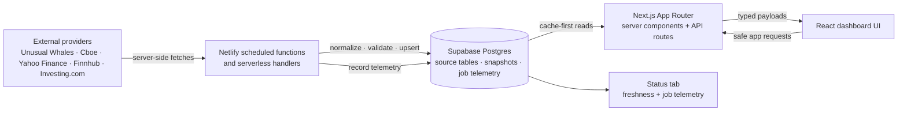

# AlphaDigest

AlphaDigest is a Next.js market-intelligence dashboard built around server-side data ingestion, Supabase-backed caches, and Netlify scheduled functions. The product UI is intentionally compact; the engineering focus is provider isolation, cache-first reads, typed API boundaries, and observable refresh jobs.

## Project overview

AlphaDigest combines market, news, calendar, flow, ownership, sentiment, and status views without exposing privileged provider credentials to the browser. Netlify functions fetch and normalize external data server-side, Supabase stores durable source rows and dashboard snapshots, and the Next.js App Router renders React views from normalized cache and API payloads.

Detailed feature and operational behavior lives in [`docs/`](docs/). This README is the durable system overview, not a changelog or implementation journal.

## Architecture at a glance



## Core engineering decisions

- **Next.js App Router and TypeScript** keep server components, API routes, page loading, and React UI boundaries typed and colocated.
- **Netlify Functions** isolate provider calls, scheduled refreshes, and service-role Supabase writes from browser traffic.
- **Supabase** is the durable normalized source store, dashboard cache, historical candle store, and job-telemetry database.
- **Server-side credentials** keep provider secrets and `SUPABASE_SERVICE_ROLE_KEY` out of browser bundles.
- **Cache-first reads** reduce latency, provider rate-limit pressure, and coupling between navigation and third-party availability.
- **Validated API envelopes** give the dashboard stable application-owned payloads rather than raw provider shapes.
- **Scheduled ingestion and bounded retention** decouple refresh work from user traffic and control high-volume cache growth.

## Data flow

1. Netlify invokes scheduled ingestion and refresh functions.
2. Functions fetch provider data with server-only credentials, then normalize and validate it.
3. Functions upsert normalized source rows and compact frontend-ready snapshots in Supabase.
4. Refresh jobs record safe runtime metadata in `job_runs`.
5. Next.js server components and API routes read snapshots or normalized tables before using an explicitly supported fallback.
6. The browser receives typed AlphaDigest payloads, never privileged provider access.
7. The Status tab combines the job registry with runtime telemetry to report freshness and failures.

Historical market charts follow the same boundary: server-side ingestion persists daily candles in Supabase, and the browser requests them through the AlphaDigest candle API rather than a provider API.

## Provider and data source overview

| Provider/source | High-level role                                                                                        |
| --------------- | ------------------------------------------------------------------------------------------------------ |
| Unusual Whales  | News, earnings, flow, institutional ownership, heatmap data, and selected historical candle ingestion. |
| Cboe            | Put/call market statistics.                                                                            |
| Yahoo Finance   | Selected market quotes, volatility metrics, and comparison data.                                       |
| Finnhub         | Configured quote, heatmap, company metadata, and incremental daily-candle flows.                       |
| Investing.com   | US economic-calendar ingestion.                                                                        |
| Supabase        | Postgres persistence, source metadata, dashboard snapshots, candle history, and refresh telemetry.     |
| Static fixtures | Explicit fallback or not-yet-live areas only; APIs identify fallback/mock modes where applicable.      |

AlphaDigest has no active Economy/FRED or congressional-data product flow. Provider contracts, fallback rules, and current source boundaries are documented in [`docs/data-sources.md`](docs/data-sources.md).

## Database schema overview

Supabase uses source-specific normalized tables alongside a small set of shared cache and operational tables. The major domains are:

- **Markets** — quotes, S&P 500 heatmap rows, put/call observations, comparison history, and market/equity/crypto daily candles.
- **News and calendar** — Unusual Whales articles, headlines, and earnings plus Investing.com economic events.
- **Flow** — dark-pool, whale-feed, and insider-trade rows.
- **Ownership** — tracked institutions, holdings, activity, exposure, and historical summaries.
- **Snapshots and cache metadata** — `dashboard_snapshots` contains compact page-ready payloads; `data_refresh_metadata` records source-level refresh state.
- **Status and observability** — `job_runs` contains scheduled-function outcomes, counts, warnings, errors, and safe metadata.

Business timestamps and ingestion timestamps remain distinct. Source rows retain the fields needed for normalization and freshness, while snapshots avoid sending large source histories such as candle arrays to ordinary page loads. See [`supabase/schema.sql`](supabase/schema.sql) and [`docs/data-sources.md`](docs/data-sources.md) for table-level details.

## API and scheduled function overview

The primary browser-safe API categories are:

- dashboard payloads for Today, Markets, News & Calendar, Flow, and Ownership;
- market candle history;
- institutional ownership detail;
- cache and source-status diagnostics.

Scheduled functions refresh market data, news and earnings, economic events, put/call observations, Flow sources, ownership data, snapshots, and daily candles. Historical repairs and backfills are separate maintenance workflows rather than interactive dashboard requests. Exact function names and schedules belong in [`docs/deployment.md`](docs/deployment.md); maintenance commands belong in [`docs/development.md`](docs/development.md).

## Status and observability

The Status tab combines a static job registry in `lib/status/jobs.ts` with runtime `job_runs` telemetry written by scheduled functions through shared helpers. It presents freshness, skipped work, warnings, failures, and unknown states without exposing secrets or raw provider responses. Netlify logs remain an operational debugging aid, not the dashboard's status data source.

## Security model

- Browser components do not call privileged provider APIs directly.
- Provider credentials and `SUPABASE_SERVICE_ROLE_KEY` are server-only and must not use the `NEXT_PUBLIC_` prefix.
- Client-visible routes return normalized application payloads rather than secret-bearing provider details.
- Logs and diagnostics expose bounded operational metadata, not credentials or raw sensitive payloads.

## Performance and reliability

- Cache-first reads and frontend-ready snapshots keep navigation responsive during provider latency or outages.
- Dashboard routes load independently; conservative route warming may occur after the active page is interactive.
- Scheduled ingestion avoids repeating provider work for each visitor.
- Retention and pruning bound high-volume caches and telemetry.
- Supported failure paths preserve last-known-good data and surface unavailable, stale, or failed states rather than silently fabricating live data.

## Local development

Requires Node.js 20 or newer and npm.

```bash
npm install
npm run dev
```

Useful checks:

```bash
npm run typecheck
npm run lint
npm run build
```

Configure only the environment variables needed for the flows you are testing. See [`docs/development.md`](docs/development.md) for local workflows and [`docs/deployment.md`](docs/deployment.md) for production configuration.

## Documentation map

- [`docs/architecture.md`](docs/architecture.md) — routing, data orchestration, caching, and shared design conventions.
- [`docs/data-sources.md`](docs/data-sources.md) — provider ingestion, normalization, persistence, retention, fallbacks, and source behavior.
- [`docs/features.md`](docs/features.md) — detailed dashboard, tab, card, and business behavior.
- [`docs/development.md`](docs/development.md) — local development, maintenance scripts, audits, backfills, and debugging.
- [`docs/deployment.md`](docs/deployment.md) — Netlify schedules, environment configuration, deployment, and operations.
- [`docs/codex-guidelines.md`](docs/codex-guidelines.md) — documentation and repository-maintenance policy for agent-assisted work.
